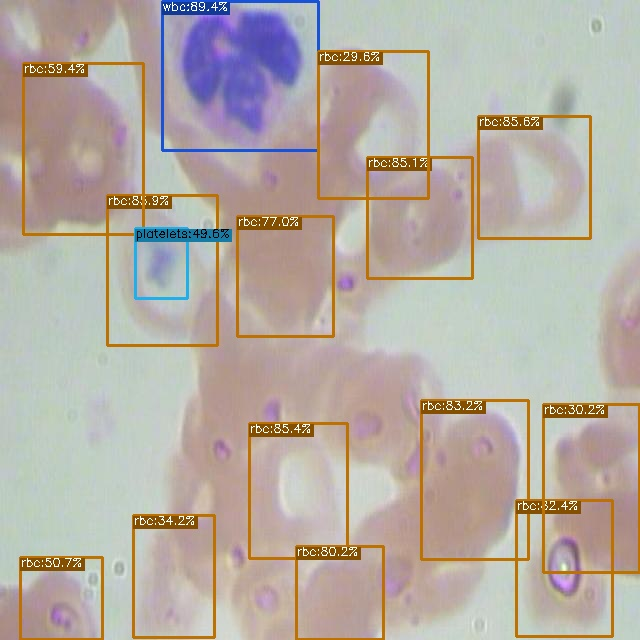
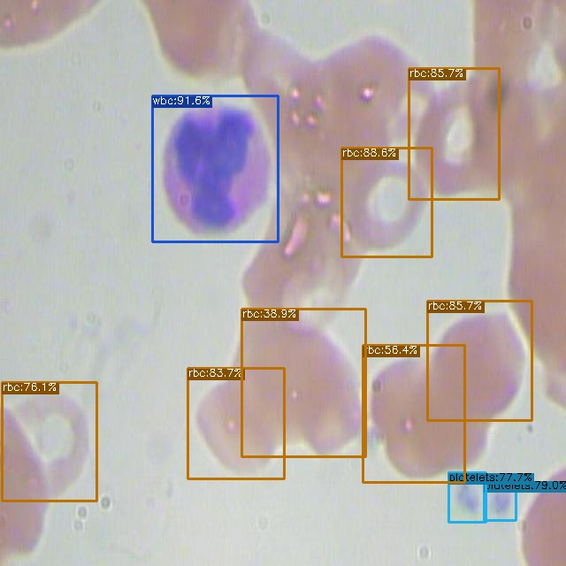
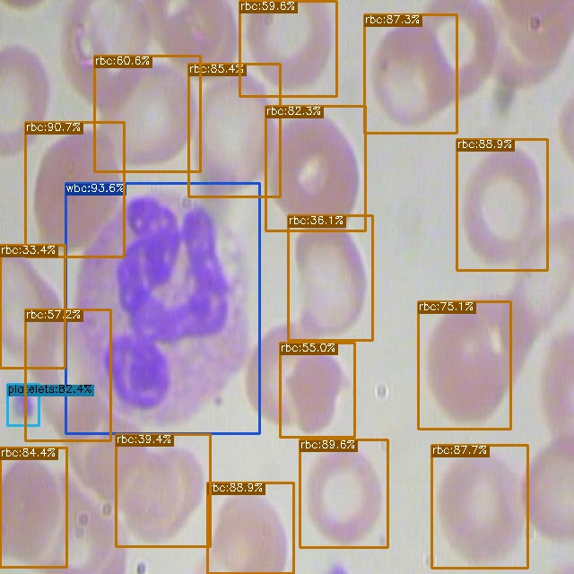
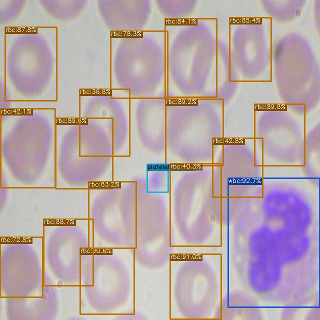

# Training-YOLOX-on-a-Custom-Dataset

In this project, I aimed to train YOLOX on custom dataset. I chose this model since it is an anchor-free version of YOLO, with a simpler design but better performance. Here I used YOLOX-s model .To implement the model for training, I used Pytorch Framework. The detector was trained relatively quickly for detecting multiple classes of objects (different blood cells) with mean AP of 0.9224.To prepare and preprocess the dataset; I used public blood cell detection dataset which was available on Roboflow. At last the model was inferred on a test image to detect RBC, WBC and Platelets.

To train the detector I took the following steps:
  -	Installed YOLOX dependencies
    -	Installed Nvidia Apex and PyCocoTools
  -	Downloaded and Prepared custom YOLOX object detection data using Roboflow
  -	Downloaded Pre-Trained Weights for YOLOX
  -	Ran YOLOX training
  -	Evaluated YOLOX performance
  -	Ran YOLOX inference on test images

The result of inference on some of the test images can be seen below:

The colab notebook for this project can be found [here](https://github.com/Aryan625/Training-YOLOX-on-a-Custom-Dataset/blob/main/Training_YOLOX_on_a_Custom_Dataset.ipynb) or in this [google drive link](https://colab.research.google.com/drive/1oV6CMuarHgLK1PzvN76iVtNQSqxHbvVC?usp=sharing)
